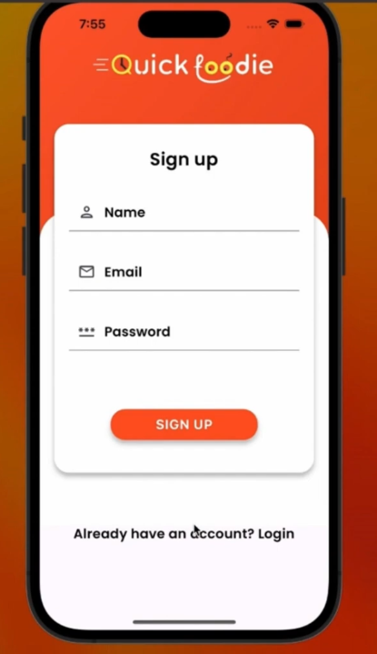
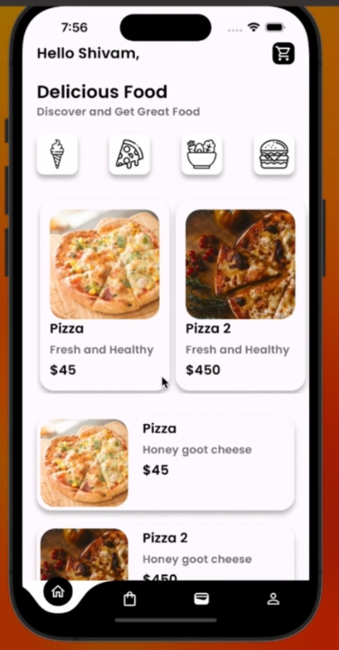
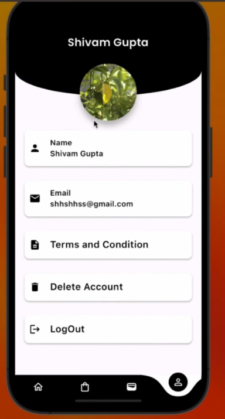
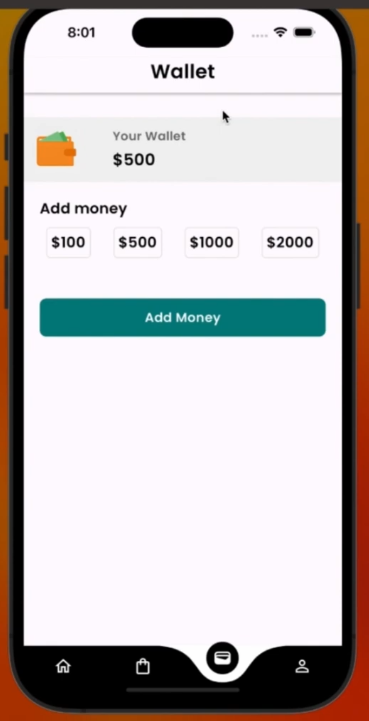
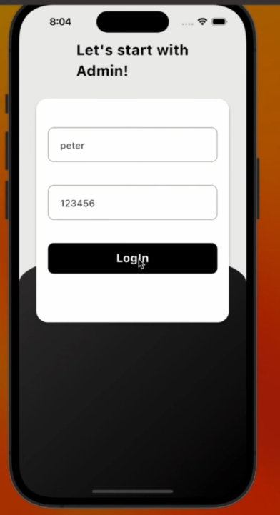

# 🍔 Food Ordering App

The Food Ordering App is a Flutter-based mobile application designed for a seamless food ordering experience. The app includes features for customers to browse menus, place orders, and track deliveries, as well as an admin panel for managing food items, categories, and orders.

---

## 🚀 Key Features

### User Features:
- 🔒 **Authentication**: Sign up, login, and forgot password functionality via Firebase.
- 🏠 **Explore Food Categories**: Pizza, Ice Cream, Burger, Salad, and more.
- 🛒 **Order Management**: Add to cart, secure checkout, and live order tracking.
- 🔔 **Notifications**: Updates for successful registration, order confirmation, and delivery status.
- 💳 **Wallet**: Track wallet balance and manage transactions.
- 👤 **Profile Management**: Update user information easily.

### Admin Features:
- 📋 **Food & Category Management**: Add, update, and delete items with category assignments.
- 🚚 **Order Management**: Track and update order statuses in real time.

---

## 🛠️ Tech Stack
- **Frontend**: Flutter (Dart)
- **Backend**: Firebase (Authentication, Firestore, Realtime Database)
- **Payment Gateway**: Placeholder for JazzCash, Google Pay, or NayaPay integration

---
---

## 📸 Screenshots

### 1️⃣ Login Screen

### 2️⃣ Signup Screen

### 3️⃣ Home Screen

### 4️⃣ Profile Screen

### 5️⃣ Wallet Screen

### 6️⃣ Admin Panel Login

---

## 🛠️ Technologies Used
- **Framework**: Flutter
- **Backend**: Firebase (Authentication, Firestore, and Realtime Database)
- **Programming Language**: Dart

---

## 📂 Project Structure
